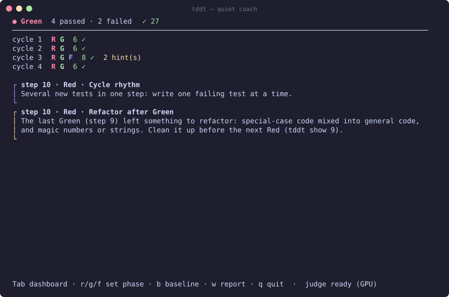
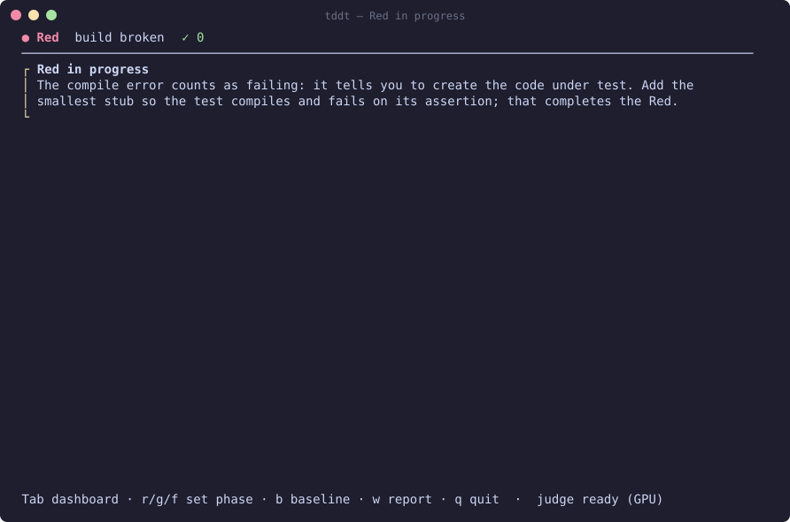
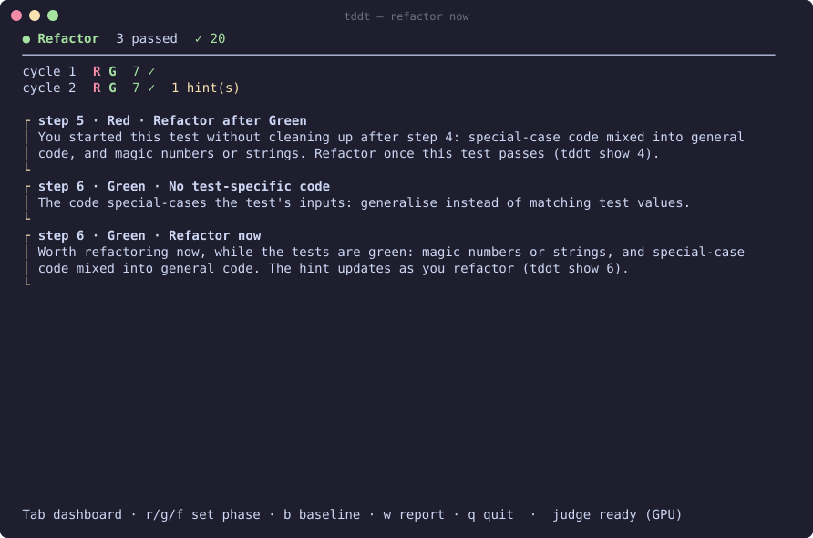
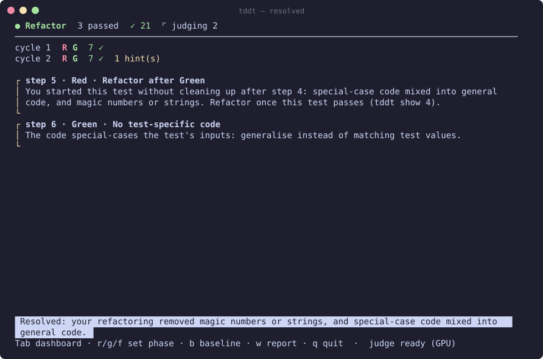
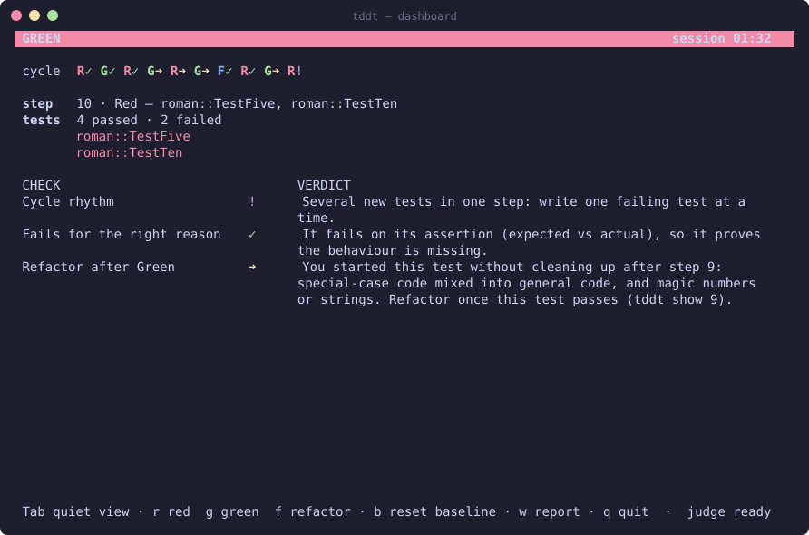
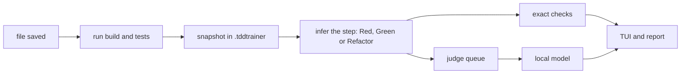

# tddt — a TDD coach in your terminal

`tddt` sits next to your editor while you practise test-driven development. Every time you save, it runs your tests, works out which step of the cycle you just finished (**Red**, **Green** or **Refactor**) and tells you how it went:

- **Red:** did you add exactly one small test, and does it fail for the right reason: on its assertion, proving the behaviour is missing, rather than on a typo, a broken setup or a crash?
- **Green:** was it the simplest change that could work (following the [Transformation Priority Premise](https://en.wikipedia.org/wiki/Transformation_Priority_Premise)), or did you jump ahead, special-case the test's inputs, or do several things at once?
- **Refactor:** right after each Green, is there something worth cleaning up? Did the tests stay green, did the behaviour stay the same, and did the code get better?

It only advises. It never blocks, reverts or touches your git repository. Checks that exact rules can't decide go to a small language model that runs **locally**, so your code never leaves your machine. When you quit, you get a Markdown report of the session.

Works on Linux and Windows (amd64) with any language. Built-in presets: **Go**, **Python** (pytest), **TypeScript/JavaScript** (jest, vitest), **.NET** (xUnit, NUnit, MSTest), **Lua** (busted) and **Elixir** (ExUnit).



## Contents

- [Install](#install)
- [A session, step by step](#a-session-step-by-step)
- [What gets checked](#what-gets-checked)
- [The session report](#the-session-report)
- [Commands and keys](#commands-and-keys)
- [Configuration](#configuration)
- [How it works](#how-it-works)

## Install

### 1. Get `tddt`

**Release archive:** download `tddt-…-linux-amd64.tar.gz` or `tddt-…-windows-amd64.zip` from the [releases page](https://github.com/sbradl/tdd-trainer/releases) and put `tddt` somewhere on your `PATH`. The archive holds just the binary.

**Or with Go 1.24+:**

```sh
go install github.com/sbradl/tdd-trainer/cmd/tddt@latest
```

### 2. Run the setup once

```sh
tddt setup
```

`tddt` runs the judge model with [llama.cpp](https://github.com/ggml-org/llama.cpp). The setup fetches everything that needs, into your user cache folder:

1. **The llama.cpp libraries** (about 65 MB). They are pinned to your `tddt` version, because the binary's bindings must match them exactly; a new `tddt` release brings newer ones.
2. **The judge model**, Qwen3.5-4B (3 GB, Apache-2.0), with progress and resume.
3. **A self-check:** it loads the model and judges one sample.

Both downloads are SHA-256 checked. Example output (progress lines shortened):

```text
Installing llama.cpp libraries into /home/you/.cache/tddt/lib
llama-b11146-bin-ubuntu-vulkan-x64.tar.gz: 31 MB downloaded
Downloading the judge model (3.0 GB) into /home/you/.cache/tddt/models/Qwen_Qwen3.5-4B-Q4_K_M.gguf
Qwen_Qwen3.5-4B-Q4_K_M.gguf:  42.0% of 3013 MB, 48.3 MB/s
…
Model: /home/you/.cache/tddt/models/Qwen_Qwen3.5-4B-Q4_K_M.gguf
Judge ready on GPU (0.9s per gate). Run tddt in your project.
```

With a GPU (through Vulkan, including integrated GPUs) a verdict takes about a second. Without one, `tddt` uses the CPU automatically and takes about 3–8 seconds. Verdicts arrive in the background either way, so you never wait for them.

**Offline or behind a proxy:** download the model file yourself from [Hugging Face](https://huggingface.co/bartowski/Qwen_Qwen3.5-4B-GGUF), then run:

```sh
tddt setup --model-file path/to/Qwen_Qwen3.5-4B-Q4_K_M.gguf
```

You can also point the `TDDT_MODEL` environment variable at the file, and `TDDT_LIB` at a folder with the llama.cpp libraries.

**No model at all:** `tddt --no-judge` runs only the exact checks.

### Windows notes

- The binaries are not code-signed, so SmartScreen may say it "protected your PC" the first time you run `tddt.exe`. Choose **More info → Run anyway**. You can check the download against `SHA256SUMS` from the release first.
- llama.cpp needs the Microsoft Visual C++ runtime. Most machines have it already. If `tddt setup` reports a missing `MSVCP140.dll` or `VCRUNTIME140.dll`, install the [Visual C++ Redistributable (x64)](https://aka.ms/vs/17/release/vc_redist.x64.exe).
- The Vulkan driver comes with your GPU driver. Without it, `tddt` uses the CPU.

## A session, step by step

This walkthrough is a Go Roman-numerals kata. Every screenshot and every piece of output below comes from a real recorded session.

Start in your project folder:

```sh
$ tddt
No .tddtrainer.yml here yet; let's create one.
Detected Go. Write .tddtrainer.yml? [Y/n]
Wrote .tddtrainer.yml.
```

`tddt` recognises the project from its marker files (`go.mod`, `package.json`, `mix.exs`, `*.csproj`, …) and writes a config you can tweak later. It then watches the folder.

**1. Write the first test.** `Roman` doesn't exist yet, so the build breaks. That compile error counts as failing: it tells you to create `Roman`. The coach shows the Red as *in progress* and asks for the smallest stub:



**2. Add the stub** (`return ""`). Now the test compiles and fails on its assertion: expected `"I"`, got `""`. That completes the Red, and it proves the behaviour really is missing. **Make it pass** with `return "I"`: that's a Green, using the simplest transformation, Nil → Constant.

**3. Refactor while it's green.** Right after each Green, the new code is reviewed. Here the learner made `Roman(2)` and `Roman(3)` pass with an `if` per number. A **Refactor now** card says what is worth cleaning up. The card for step 5 is from the cycle before: there, the learner started the next test without cleaning up first.



Each green save while you refactor re-checks it. A cosmetic change gets "Still there in roman.go after your last change". Replacing the `if`s with `strings.Repeat("I", n)` resolves it, and the card goes away with a confirmation:



**4. Keep going.** Each finished Red → Green → Refactor cycle folds into one summary line. Cards appear only for hints and warnings. OK verdicts just increase the ✓ counter in the status line, so the view stays quiet while you do things right. In the screenshot at the top, the learner:

- added two tests at once (step 10), which gives a warning;
- special-cased `n == 4` instead of generalising. The coach names what to clean up and which step to look at.

**5. Press Tab for the dashboard.** It shows the cycle strip (✓ ok, ➜ hint, ! warning), the tests, and every check of the current step. That includes pending ones with their expected time, and uncertain ones, greyed out:



**6. Stuck on the next test? Press `n`.** While the tests are green, `tddt` suggests which kind of test to write next. Press once for the kind ("Try an edge case."), press again for the case ("No test yet at an edge where the result switches from one rule to another …"). The first press takes a few seconds while the judge looks at your tests (it goes ahead of other checks); after that, each press answers at once until your tests change. If your last Green faked the result with a constant, it tells you to triangulate first. The hint goes away once you write the next test.

**7. Quit with `q`.** `tddt` writes the report and prints a summary.

### Without a terminal UI

When stdout isn't a terminal (piped, in CI, in an editor's task runner), `tddt` prints plain lines instead. Here is the same kind of session:

```text
Watching (judge loading…); Ctrl-C to quit.
tests (0.1s): all green
» baseline set
judge ready (GPU)
changed: roman_test.go
tests (0.1s): build broken
» Red in progress: add the smallest stub so the new test compiles and fails on its assertion
changed: roman.go
tests (0.2s): 1 failing:
  roman::TestOne
» step 1: Red — roman::TestOne
changed: roman.go
tests (0.1s): all green
» step 2: Green
changed: roman_test.go
tests (0.7s): 1 failing:
  roman::TestTwo
» step 3: Red — roman::TestTwo (directly after a Green: checking for a missed refactor)
changed: roman.go
tests (0.3s): all green
» step 4: Green
changed: roman.go
tests (0.5s): all green
  HINT step 4 (Green) Refactor now: Worth refactoring roman.go now, while the tests are green: special-case code mixed into general code, and magic numbers or strings. The hint updates as you refactor (tddt show 4).
  RESOLVED step 4 (Green) Refactor now: Resolved: your refactoring removed special-case code mixed into general code, and magic numbers or strings.
changed: roman_test.go
tests (0.1s): all green
» step 5: Anomaly — roman::TestThree [new or changed test passed without failing first]
  WARNING step 5 (Anomaly) Cycle rhythm: A new or changed test passed without failing first: make sure it can fail, or it proves nothing.
Session: 1m16s, 2 cycles, 3 tests added, clean cycles 1 of 2 (50%).
Focus: A new or changed test passed without failing first: make sure it can fail, or it proves nothing.
Report: .tddtrainer/reports/2026-09-26T19-52-12.md
```

### Looking at a step afterwards

`tddt show` prints a step of the last session with all its verdicts, including the uncertain ones, and the full diff:

```text
$ tddt show 4
Step 4: Green
snapshots bee8451a..ca7e661d

✓ Transformation               Applied Unconditional → Selection (4/8).
✓ Simplest change              The test needed a simple change and the code made one: no bigger than necessary.
✓ One transformation           One transformation, as a single new test should need.
? No test-specific code        The judge could not decide (best guess "yes", p=0.76).
✓ Refactor now                 Resolved: your refactoring removed special-case code mixed into general code, and magic numbers or strings.

diff --git a/roman.go b/roman.go
--- a/roman.go
+++ b/roman.go
@@ -1,3 +1,8 @@
 package roman
 
-func Roman(n int) string { return "I" }
+func Roman(n int) string {
+	if n == 2 {
+		return "II"
+	}
+	return "I"
+}
```

## What gets checked

Exact rules come first. The judge only answers what they can't decide.

| Step | Check | What it means | How |
|---|---|---|---|
| Red | **One new test** | A Red adds exactly one failing test. | exact |
| Red | **Small test** | The new test adds at most ~15 lines. | exact |
| Red | **Fails for the right reason** | It fails on its assertion (expected vs actual). A compile error only means the stub is still missing (Red in progress); an import error, broken setup or crash is the wrong reason. | exact where the runner tells, else judge |
| Red | **One behaviour per test** | All its assertions check one outcome. | judge |
| Green | **Transformation** | Which [TPP](https://blog.cleancoder.com/uncle-bob/2013/05/27/TheTransformationPriorityPremise.html) step was applied: {}→Nil, Nil→Constant, Constant→Variable, Unconditional→Selection, Value→List, Selection→Iteration, Statement→Recursion, Value→Mutated Value. | judge |
| Green | **Simplest change** | The change is no bigger than the failing test needed. | judge |
| Green | **One transformation** | Several at once suggest a missing test. | judge |
| Green | **No test-specific code** | No special-casing of the tests' exact inputs, beyond a first fake-it. | judge |
| Refactor | **Tests stayed green** | Every test kept passing. | exact |
| Refactor | **Behaviour unchanged** | Only structure changed. | judge |
| Refactor | **Design effect** | The code got easier to read or change (or not). | judge |
| After Green | **Refactor now** | The new code is reviewed through four lenses (code smells, Clean Code, Pragmatic Programmer, module design). If something is worth cleaning up, the hint names it, and it is re-checked on every green save until resolved. | judge |
| After Green | **Refactor tests now** | The test code is reviewed too, with its own checks (literals and repeated values are normal in tests): test bodies that repeat the same steps, names that don't say the behaviour, expected values computed instead of stated, failures without expected and actual. Re-checked on every green save that changes tests. | judge |
| Next Red | **Refactor after Green** | Did you start the next test with a *Refactor now* or *Refactor tests now* problem still unresolved? | from the re-checks |
| On request | **Next test** | Which kind of test to write next: the first case of the ZOMBIES checklist (zero/empty, one, many, boundaries, errors) that no test covers yet, or "triangulate" right after a fake-it Green. Only asked for with `n` or `tddt next`; it never counts against a cycle. | judge |
| any | **Cycle rhythm** | Several new tests at once; a test that passes without failing first; code written without a failing test; a test edited during Green; an existing test breaking. | exact |

Every verdict is advisory. The judge answers only when it is at least 80% sure (45% for "simplest change"). Anything less is marked **uncertain**: it is not shown during the session and is listed in the report.

## The session report

When you quit (or press `w`), `tddt` writes `.tddtrainer/reports/<start time>.md`. It contains:
- the session's numbers;
- the three hints that came up most often, as focus tips, plus how often you asked for the next test;
- a table per cycle with every verdict;
- diffs for the steps that got a hint;
- your transformation path;
- anomalies and missed refactors;
- the uncertain verdicts;
- a legend of the checks.

It gives no scores.

**[See a full sample report](docs/sample-report.md)**, from the session in the screenshots. An excerpt:

> | Duration | Cycles | Tests added | Clean cycles |
> |---|---|---|---|
> | 1m32s | 5 | 6 | 1 of 5 (20%) |
>
> **Focus tips**
>
> 1. **Refactor after Green** (2×): You started this test without cleaning up roman.go after step 9: special-case code mixed into general code, and magic numbers or strings. Refactor once this test passes (tddt show 9).
> 2. **Refactor now** (2×): Worth refactoring roman.go now, while the tests are green: special-case code mixed into general code, and magic numbers or strings. The hint updates as you refactor (tddt show 9).
> 3. **Cycle rhythm** (1×): Several new tests in one step: write one failing test at a time.
>
> **Transformation path**
>
> 2: Nil → Constant (2/8) → 4: Unconditional → Selection (4/8) → 6: Unconditional → Selection (4/8) → 9: Unconditional → Selection (4/8)

## Commands and keys

```text
tddt [--once] [--no-judge] [--cpu] [--resume] [dir]
                                           watch and coach the project in dir (default .)
tddt init [--preset NAME] [--yes] [dir]    write .tddtrainer.yml (detects the project type)
tddt setup [--model-file F] [--lib-dir D]  install the judge's libraries and model
tddt show STEP [dir]                       a step of the last session: verdicts and full diff
tddt next [--cpu] [dir]                    which test to write next, for the code as it is now
tddt judge --regress [--cpu] [--gate G]    check the judge against its labelled fixtures
```

- `--once` runs the tests once and prints the test state.
- `--no-judge` runs only the exact checks.
- `--cpu` never uses the GPU.
- `--resume` continues the last session instead of starting a new one: the step numbers go on, the report covers the whole session (without the time `tddt` wasn't running), and open hints of the last Green are re-checked as you refactor. Changes you made while `tddt` was off count like a save.

| Key | |
|---|---|
| Tab | switch between the quiet coach and the dashboard |
| r | "I'm writing a test": sets the phase to Red |
| g | "I'm making it pass": sets the phase to Green |
| f | "I'm refactoring": sets the phase to Refactor |
| b | reset the baseline: the next test run is the new starting point |
| n | which test to write next; press again for more detail |
| w | write the report now |
| q, Ctrl-C | quit (writes the report) |

Use r/g/f when the coach misreads what you are doing. A short message confirms the change.

## Configuration

`.tddtrainer.yml` in the project root; `tddt init` writes one from a preset:

```yaml
preset: go
build: go vet ./...              # optional; a failure means "build broken"
test:
  cmd: go test -json ./...
  windows: go test -json ./...   # optional override for Windows
env: {}                          # extra environment for build and test
results: { format: go-json }     # junit-xml | go-json | trx; add path: for result files
tests:   ["**/*_test.go"]         # which files are tests …
sources: ["**/*.go"]              # … and which are production code
ignore:  [".tddtrainer/**", "vendor/**"]
tpp_order: iteration-first       # or recursion-first (the Elixir preset)
slow_run_warning: 5s
```

- The coach needs structured results (JUnit XML, `go test -json` or .NET TRX) to know which test failed and why. Without `results`, it falls back to the exit code, and the verdicts are weaker.
- The Elixir preset needs the `junit_formatter` package, and the jest preset needs `jest-junit`. `tddt init` tells you what to add.
- Everything the coach stores lives in `.tddtrainer/`: snapshots in a private git repository, session files and reports. That folder ignores itself in git, and your own repository is never touched.

## How it works



- **Watching:** file changes are debounced. A new save cancels a test run still in progress, including its child processes.
- **Steps:** a step is everything between two changes of the test state. New tests are found by comparing the test IDs of consecutive runs, so no parser for your language is needed.
- **Judge:** it follows [SemIf](https://github.com/TheoLeeCJ/SemIf)'s direct mode. Each check is a multiple-choice question. One forward pass of the model gives the probability of each answer letter, and no text is generated. The model stays loaded, and checks that share the same evidence reuse the computed prompt prefix.
- **Regression suite:** the questions are tuned against labelled fixtures in six languages. Run `tddt judge --regress` to see how the judge does on your machine: 117 of 130 fixtures are answered confidently and correctly, and none confidently wrong, on both CPU and GPU.

## Changes

See [CHANGELOG.md](CHANGELOG.md).

## Licence

MIT, see [LICENSE](LICENSE). `tddt setup` downloads llama.cpp (MIT) and the judge model (Apache-2.0).
