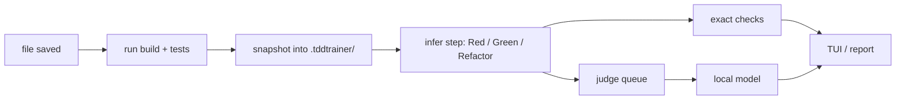

# tddt — a TDD coach in your terminal

`tddt` sits next to your editor while you practise test-driven development. Every time you save, it runs your tests, works out which step of the cycle you just finished (**Red**, **Green** or **Refactor**) and tells you how it went:

- **Red:** did you add exactly one small test, and does it fail for the right reason (on its assertion, not on a compile error)?
- **Green:** was it the simplest change that could work (following the [Transformation Priority Premise](https://en.wikipedia.org/wiki/Transformation_Priority_Premise)), or did you jump ahead, special-case the test's inputs, or do several things at once?
- **Refactor:** did the tests stay green, did the behaviour stay the same, and did the code get better? And did you skip refactoring when the code needed it?

It only advises. It never blocks, reverts or touches your git repository. Checks that exact rules can't decide go to a small language model that runs **locally**, so your code never leaves your machine. When you quit, you get a Markdown report of the session.

Works on Linux and Windows (amd64) with any language. Built-in presets: **Go**, **Python** (pytest), **TypeScript/JavaScript** (jest, vitest), **.NET** (xUnit, NUnit, MSTest), **Lua** (busted) and **Elixir** (ExUnit).


## Contents

- [Install](#install)
- [A session, step by step](#a-session-step-by-step)
- [What gets checked](#what-gets-checked)
- [The session report](#the-session-report)
- [Commands and keys](#commands-and-keys)
- [Configuration](#configuration)
- [How it works](#how-it-works)

## Install

### 1. Get `tddt`

**Release archive (recommended).** Download `tddt-…-linux-amd64.tar.gz` or `tddt-…-windows-amd64.zip` from the [releases page](https://github.com/sbradl/tdd-trainer/releases) and unpack it anywhere, ideally somewhere on your `PATH`. The archive contains `tddt` and the llama.cpp libraries the judge needs.

**With Go 1.24+:**

```sh
go install github.com/sbradl/tdd-trainer/cmd/tddt@latest
```

`tddt setup` then downloads the libraries too.

### 2. Run the setup once

```sh
tddt setup
```

This does three things:

1. It installs the llama.cpp libraries if they are not there yet: a pinned build, SHA-256 checked, about 65 MB.
2. It downloads the judge model, Qwen3.5-4B (3 GB, Apache-2.0), into your user cache folder, with progress and resume. It checks the SHA-256 too.
3. It loads the model and judges one sample, to prove everything works:

```text
Installing llama.cpp libraries into /home/you/.cache/tddt/lib
llama-b11146-bin-ubuntu-vulkan-x64.tar.gz: 31 MB downloaded
Downloading the judge model (3.0 GB) into /home/you/.cache/tddt/models/Qwen_Qwen3.5-4B-Q4_K_M.gguf
Qwen_Qwen3.5-4B-Q4_K_M.gguf:  42.0% of 3013 MB, 48.3 MB/s
…
Model: /home/you/.cache/tddt/models/Qwen_Qwen3.5-4B-Q4_K_M.gguf
Judge ready on GPU (0.9s per gate). Run tddt in your project.
```

With a GPU (through Vulkan, including integrated GPUs) a verdict takes about a second. Without one, `tddt` uses the CPU automatically and takes about 3–8 seconds. Verdicts arrive in the background either way, so you never wait for them.

**Offline or behind a proxy:** download the model file yourself from [Hugging Face](https://huggingface.co/bartowski/Qwen_Qwen3.5-4B-GGUF), then run:

```sh
tddt setup --model-file path/to/Qwen_Qwen3.5-4B-Q4_K_M.gguf
```

You can also point the `TDDT_MODEL` environment variable at the file. `TDDT_LIB` points at a folder with the llama.cpp libraries.

**No model at all:** `tddt --no-judge` runs only the exact checks.

### Windows notes

- The binaries are not code-signed, so SmartScreen may say it "protected your PC" the first time you run `tddt.exe`. Choose **More info → Run anyway**. You can check the download against `SHA256SUMS` from the release first.
- The archive includes the Microsoft VC++ runtime DLLs next to `tddt.exe`. The Vulkan driver comes with your GPU driver; without it, `tddt` falls back to the CPU.

## A session, step by step

This walkthrough is a Go Roman-numerals kata. Every screenshot and every piece of output below comes from a real recorded session.

Start in your project folder:

```sh
$ tddt
No .tddtrainer.yml here yet; let's create one.
Detected Go. Write .tddtrainer.yml? [Y/n]
Wrote .tddtrainer.yml.
```

`tddt` recognises the project from its marker files (`go.mod`, `package.json`, `mix.exs`, `*.csproj`, …) and writes a config you can tweak later. It then watches the folder.

**1. Write the first test.** `Roman` doesn't exist yet, so the build breaks. A compile error is not a proper Red, and the coach says so:


**2. Add a stub** (`return ""`). Now the test fails on its assertion, which completes the Red. **Make it pass** with `return "I"`: that's a Green, using the simplest transformation, Nil → Constant.

**3. Keep going.** Each finished Red → Green → Refactor cycle folds into one summary line. Cards appear only for hints and warnings. OK verdicts just increase the ✓ counter in the status line, so the view stays quiet while you do things right. In the screenshot at the top, the learner:

- added two tests at once (step 10), which gives a warning;
- didn't clean up after special-casing `n == 4`. The coach names what to clean up and which step to look at.

**4. Press Tab for the dashboard.** It shows the cycle strip (✓ ok, ➜ hint, ! warning), the tests, and every check of the current step. That includes pending ones with their expected time, and uncertain ones, greyed out:


**5. Quit with `q`.** `tddt` writes the report and prints a summary.

### Without a terminal UI

When stdout isn't a terminal (piped, in CI, in an editor's task runner), `tddt` prints plain lines instead. Here is the same kind of session:

```text
Watching (judge loading…); Ctrl-C to quit.
tests (0.1s): all green
» baseline set
judge ready (GPU)
changed: roman_test.go
tests (0.1s): build broken
» Red in progress: the new test does not fail on an assertion yet
changed: roman.go
tests (0.2s): 1 failing:
  roman::TestOne
» step 1: Red — roman::TestOne
changed: roman.go
tests (0.1s): all green
» step 2: Green
changed: roman_test.go
tests (0.7s): 1 failing:
  roman::TestTwo
» step 3: Red — roman::TestTwo (directly after a Green: checking for a missed refactor)
changed: roman.go
tests (0.2s): all green
» step 4: Green
changed: roman_test.go
tests (1.1s): 1 failing:
  roman::TestThree
» step 5: Red — roman::TestThree (directly after a Green: checking for a missed refactor)
changed: roman.go
tests (1.1s): all green
» step 6: Green
  HINT step 5 (Red) Refactor after Green: The last Green (step 4) left something to refactor: special-case code mixed into general code, and magic numbers or strings. Clean it up before the next Red (tddt show 4).
Session: 56s, 3 cycles, 3 tests added, clean cycles 2 of 3 (66%).
Focus: The last Green (step 4) left something to refactor: special-case code mixed into general code, and magic numbers or strings. Clean it up before the next Red (tddt show 4).
Report: .tddtrainer/reports/2026-09-26T19-34-08.md
```

### Looking at a step afterwards

`tddt show` prints a step of the last session with all its verdicts, including the uncertain ones, and the full diff:

```text
$ tddt show 4
Step 4: Green
snapshots bdf398dc..64c460d1

✓ Transformation               Applied Unconditional → Selection (4/8).
✓ Simplest change              The test needed a simple change and the code made one: no bigger than necessary.
✓ One transformation           One transformation, as a single new test should need.
? No test-specific code        The judge could not decide (best guess "yes", p=0.76).

diff --git a/roman.go b/roman.go
--- a/roman.go
+++ b/roman.go
@@ -1,3 +1,8 @@
 package roman
 
-func Roman(n int) string { return "I" }
+func Roman(n int) string {
+	if n == 2 {
+		return "II"
+	}
+	return "I"
+}
```

## What gets checked

Exact rules come first. The judge only answers what they can't decide.

| Step | Check | What it means | How |
|---|---|---|---|
| Red | **One new test** | A Red adds exactly one failing test. | exact |
| Red | **Small test** | The new test adds at most ~15 lines. | exact |
| Red | **Fails for the right reason** | It fails on its assertion (expected vs actual), not on a compile error, import error or crash. | exact where the runner tells, else judge |
| Red | **One behaviour per test** | All its assertions check one outcome. | judge |
| Green | **Transformation** | Which [TPP](https://blog.cleancoder.com/uncle-bob/2013/05/27/TheTransformationPriorityPremise.html) step was applied: {}→Nil, Nil→Constant, Constant→Variable, Unconditional→Selection, Value→List, Selection→Iteration, Statement→Recursion, Value→Mutated Value. | judge |
| Green | **Simplest change** | The change is no bigger than the failing test needed. | judge |
| Green | **One transformation** | Several at once suggest a missing test. | judge |
| Green | **No test-specific code** | No special-casing of the tests' exact inputs, beyond a first fake-it. | judge |
| Refactor | **Tests stayed green** | Every test kept passing. | exact |
| Refactor | **Behaviour unchanged** | Only structure changed. | judge |
| Refactor | **Design effect** | The code got easier to read or change (or not). | judge |
| Red after Green | **Refactor after Green** | The last Green is reviewed through five lenses (code smells, Clean Code, domain design, Pragmatic Programmer, module design); if something is worth cleaning up, the hint names it. | judge |
| any | **Cycle rhythm** | Several new tests at once; a test that passes without failing first; code written without a failing test; a test edited during Green; an existing test breaking. | exact |

Every verdict is advisory. The judge answers only when it is at least 80% sure (45% for "simplest change"). Anything less is marked **uncertain**: it is not shown during the session and is listed in the report.

## The session report

When you quit (or press `w`), `tddt` writes `.tddtrainer/reports/<start time>.md`. It contains:
- the session's numbers;
- the three hints that came up most often, as focus tips;
- a table per cycle with every verdict;
- diffs for the steps that got a hint;
- your transformation path;
- anomalies and missed refactors;
- the uncertain verdicts;
- a legend of the checks.

It gives no scores.

**[See a full sample report](docs/sample-report.md)**, from the session in the screenshots. An excerpt:

> | Duration | Cycles | Tests added | Clean cycles |
> |---|---|---|---|
> | 1m25s | 5 | 6 | 3 of 5 (60%) |
>
> **Focus tips**
>
> 1. **Refactor after Green** (2×): The last Green (step 9) left something to refactor: special-case code mixed into general code, and magic numbers or strings. Clean it up before the next Red (tddt show 9).
> 2. **Cycle rhythm** (1×): Several new tests in one step: write one failing test at a time.
> 3. **No test-specific code** (1×): The code special-cases the test's inputs: generalise instead of matching test values.
>
> **Transformation path**
>
> 2: Nil → Constant (2/8) → 4: Unconditional → Selection (4/8) → 6: Unconditional → Selection (4/8) → 9: Unconditional → Selection (4/8)

## Commands and keys

```text
tddt [--once] [--no-judge] [--cpu] [dir]   watch and coach the project in dir (default .)
tddt init [--preset NAME] [--yes] [dir]    write .tddtrainer.yml (detects the project type)
tddt setup [--model-file F] [--lib-dir D]  install the judge's libraries and model
tddt show STEP [dir]                       a step of the last session: verdicts and full diff
tddt judge --regress [--cpu] [--gate G]    check the judge against its labelled fixtures
```

- `--once` runs the tests once and prints the test state.
- `--no-judge` runs only the exact checks.
- `--cpu` never uses the GPU.

| Key | |
|---|---|
| Tab | switch between the quiet coach and the dashboard |
| r | "I'm writing a test": sets the phase to Red |
| g | "I'm making it pass": sets the phase to Green |
| f | "I'm refactoring": sets the phase to Refactor |
| b | reset the baseline: the next test run is the new starting point |
| w | write the report now |
| q, Ctrl-C | quit (writes the report) |

Use r/g/f when the coach misreads what you are doing. A short message confirms the change.

## Configuration

`.tddtrainer.yml` in the project root; `tddt init` writes one from a preset:

```yaml
preset: go
build: go vet ./...              # optional; a failure means "build broken"
test:
  cmd: go test -json ./...
  windows: go test -json ./...   # optional override for Windows
env: {}                          # extra environment for build and test
results: { format: go-json }     # junit-xml | go-json | trx; add path: for result files
tests:   ["**/*_test.go"]         # which files are tests …
sources: ["**/*.go"]              # … and which are production code
ignore:  [".tddtrainer/**", "vendor/**"]
tpp_order: iteration-first       # or recursion-first (the Elixir preset)
slow_run_warning: 5s
```

- The coach needs structured results (JUnit XML, `go test -json` or .NET TRX) to know which test failed and why. Without `results`, it falls back to the exit code, and the verdicts are weaker.
- The Elixir preset needs the `junit_formatter` package, and the jest preset needs `jest-junit`. `tddt init` tells you what to add.
- Everything the coach stores lives in `.tddtrainer/`: snapshots in a private git repository, session files and reports. That folder ignores itself in git, and your own repository is never touched.

## How it works



- **Watching:** file changes are debounced. A new save cancels a test run still in progress, including its child processes.
- **Steps:** a step is everything between two changes of the test state. New tests are found by comparing the test IDs of consecutive runs, so no parser for your language is needed.
- **Judge:** it follows [SemIf](https://github.com/TheoLeeCJ/SemIf)'s direct mode. Each check is a multiple-choice question. One forward pass of the model gives the probability of each answer letter, and no text is generated. The model stays loaded, and checks that share the same evidence reuse the computed prompt prefix.
- **Regression suite:** the questions are tuned against labelled fixtures in six languages. Run `tddt judge --regress` to see how the judge does on your machine: 92 of 101 fixtures are answered confidently and correctly, and none confidently wrong, on both CPU and GPU.

## Licence

MIT, see [LICENSE](LICENSE). The release archives also contain llama.cpp (MIT) and, on Windows, the Microsoft VC++ runtime DLLs. The judge model is Apache-2.0.
